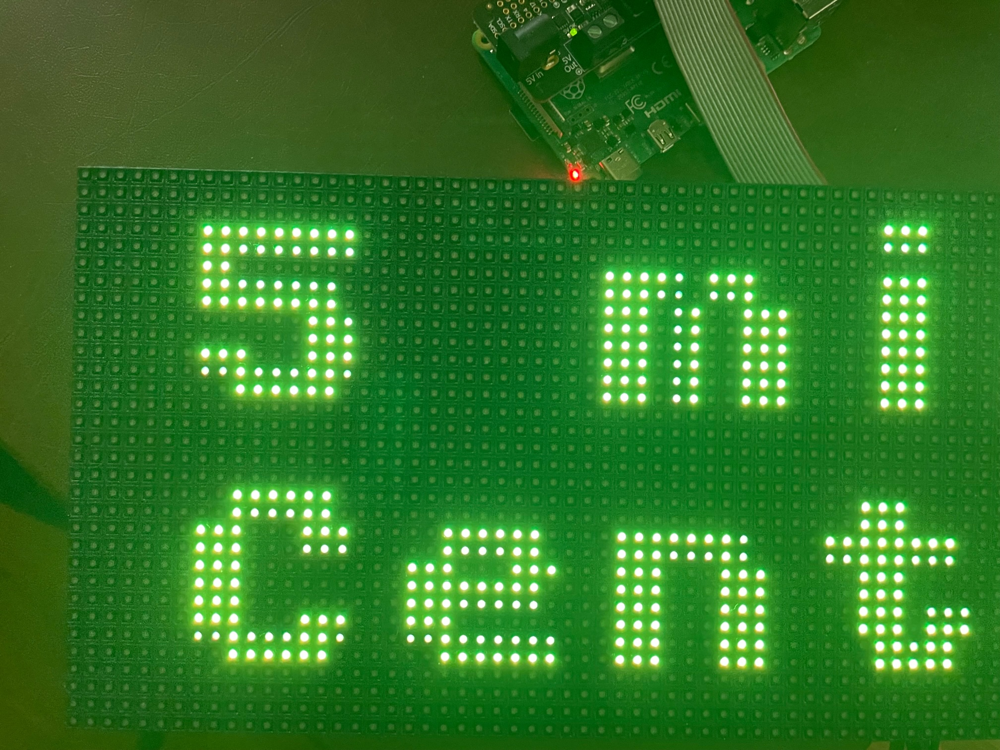
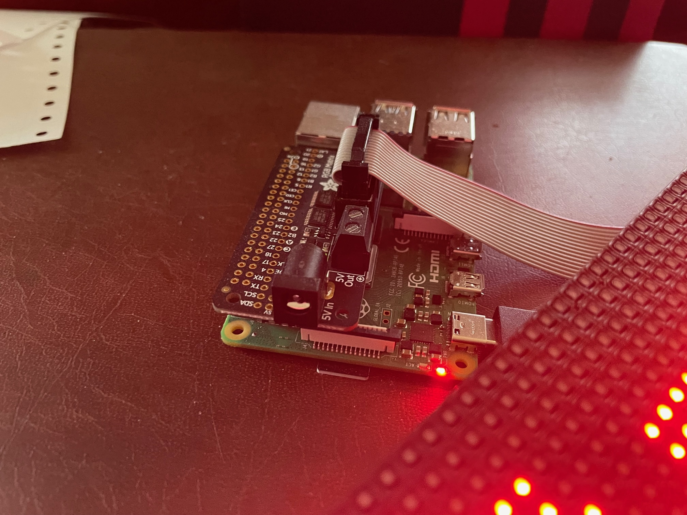

This respository contains the software side of a Raspberry Pi project. It corresponds to a Raspberry Pi (4 Model B) hooked up to a 32x64 matrix of LED lights which have been programmed to scroll the departure times of the next NYC-bound PATH Trains (think subway) leaving from Grove Street station in Jersey City headed to World Trade Center and 33rd Street in Manhattan. So the idea is, if you hang the LED matrix display on your wall, you'll know whether to mosey, walk, or run to make the next train. 

This code scrapes data from the Path website. There is a PATH tain API that a developer made available (mrazza; https://path.api.razza.dev/v1/stations/grove_street/realtime), but we did not want to rely on an existing API. We wanted a more general solution for getting content from the web under the assumption that an API won't always be available. 

(Disclaimer: You'll need to update this logic if the layout of the PATH train webpage changes. Also, consider adding a button that only starts the LED up when you need it, so your IP is not refreshing the PATH website every few seconds.)

(Note: You can modify the code to reference a different train station on the PATH website, scrape and then reference another transit system's website altogether, or scroll completely unrelated content from the web across the LED light display.)

The text scroll includes two unnecessary but fun features: images and sounds from Digital Physics the video game. Feel free to disable the code that plays the sound if it drives you crazy.

Video Game:
https://digital-physics.itch.io/digital-physics

Here are some helpful project links:

Tutorial on LED matrix hardware and software:
https://www.youtube.com/watch?v=xSwoM3M24W8&t=516s
Note: We did find the "isolcpus=3" tip on https://github.com/hzeller/rpi-rgb-led-matrix helpful in reducing LED update flicker.

Adafruit Raspberry Pi Bonnet:
https://www.electromaker.io/shop/product/adafruit-rgb-matrix-bonnet-for-raspberry-pi

LED Matrix:
https://www.adafruit.com/product/2278

5V 4A power supply:
https://www.amazon.com/dp/B0BD72BWBK

SSH (not needed, but a convenient way to run code on your Raspberry Pi via your main computer):
https://roboticsbackend.com/enable-ssh-on-raspberry-pi-raspbian/

If you've already set up your Pi, you may need to use the Raspberry Pi user name you designated at set-up time and Rasperry pi IP

"ssh jdkhanlian@123.456.7.890" and when prompted for a password, use your Raspberry pi account password

To find the Raspberry Pi IP on your WLAN, try "ping raspberrypi.local" or if you're on your Raspberry Pi use "hostname -I"

Audio Note: 
Static was encountered on our Bluetooth speaker that was connected to the Raspberry Pi 4 model b.
To avoid it, open the config file with "sudo nano /boot/config.txt" and add this line to the config.txt file:
"audio_pwm_mode=2"

